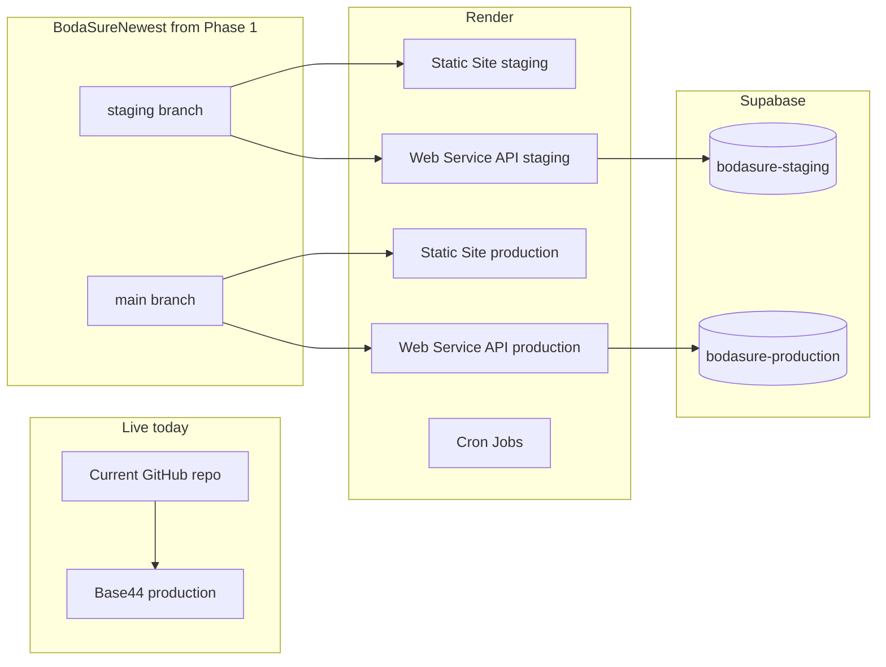

# BodaSure Migration — Target Architecture

> Agents read this instead of guessing stack, paths, or env var names.
> Last updated: 2026-07-08

---

## 1. Dual-run model (until Phase 26)



| Environment | Git branch | Render | Supabase project |
|-------------|------------|--------|------------------|
| Staging | `staging` | Staging static + API | `bodasure-staging` |
| Production | `main` | Production static + API | `bodasure-production` |
| Live (until cutover) | N/A | Base44 | Base44 |

---

## 2. Technology mapping

| Concern | Today (Base44) | Target (Render + Supabase) |
|---------|----------------|----------------------------|
| Frontend hosting | Base44 | Render Static Site (`npm run build` → `dist/`) |
| API + webhooks | `base44/functions/*/entry.ts` (40 Deno handlers) | Render Web Service `api/` (Node + Hono) |
| Database | Base44 entities | Supabase Postgres |
| Auth | `base44.auth.*` | Supabase Auth + `profiles` table |
| File uploads | `base44.integrations.Core.UploadFile` | Supabase Storage signed URLs |
| Realtime | `base44.entities.Wallet.subscribe()` | Supabase Realtime |
| Cron | Base44 automations | Render Cron Jobs |
| Secrets | Base44 Dashboard | Render env vars + Supabase dashboard |

---

## 3. Repository layout (target)

```
BodaSureNewest/
├── docs/
│   ├── MIGRATION_PHASES.md      # Phase master list
│   ├── MIGRATION_STATE.md       # Current phase (agents read first)
│   └── MIGRATION_ARCHITECTURE.md # This file
├── src/                         # React frontend (existing)
│   ├── api/
│   │   ├── base44Client.js      # Legacy — behind VITE_STACK=base44
│   │   ├── supabaseClient.js    # Phase 17+
│   │   └── dataClient.js        # Phase 17 — unified data access
│   └── lib/AuthContext.jsx      # Phase 18 — Supabase session
├── api/                         # Phase 15+ — Render Web Service
│   └── src/index.ts             # Hono app, webhooks, routes
├── supabase/                    # Phase 3+ — migrations, config
│   ├── config.toml
│   └── migrations/
├── base44/                      # Reference only during migration
│   ├── entities/*.jsonc         # Source of truth for schema (31 files)
│   └── functions/*/entry.ts     # Source of truth for API port (40 files)
├── render.yaml                  # Phase 13 — Render Blueprint
└── package.json
```

---

## 4. Feature flag: dual stack

| Env var | Values | Purpose |
|---------|--------|---------|
| `VITE_STACK` | `base44` (default on live) / `supabase` (staging) | Switch frontend data layer |
| `VITE_API_URL` | Render API URL | New backend base URL |
| `VITE_SUPABASE_URL` | Supabase project URL | Frontend Supabase client |
| `VITE_SUPABASE_ANON_KEY` | Supabase anon key | Frontend (public, RLS-protected) |

Frontend checks `import.meta.env.VITE_STACK === 'supabase'` to route through new clients.

---

## 5. Environment variables

### 5.1 Frontend (Render Static Site — public)

| Variable | Staging | Production | Notes |
|----------|---------|------------|-------|
| `VITE_STACK` | `supabase` | `supabase` | After Phase 14 |
| `VITE_API_URL` | `https://bodasure-api-staging.onrender.com` | TBD | Set in Phase 16 |
| `VITE_SUPABASE_URL` | Staging project URL | Prod project URL | From Supabase dashboard |
| `VITE_SUPABASE_ANON_KEY` | Staging anon key | Prod anon key | Never service_role |
| `VITE_MAPBOX_TOKEN` | Same or staging token | Production token | Existing |

### 5.2 API service (Render Web Service — secret)

| Variable | Used for | Notes |
|----------|----------|-------|
| `SUPABASE_URL` | DB + auth admin | Server-side |
| `SUPABASE_SERVICE_ROLE_KEY` | Webhooks, admin writes | **Never** expose to frontend |
| `SASAPAY_CLIENT_ID` | OAuth + HMAC webhook | Same as today |
| `SASAPAY_CLIENT_SECRET` | OAuth | Same as today |
| `SASAPAY_MERCHANT_CODE` | Payments | Same as today |
| `SASAPAY_ENVIRONMENT` | `sandbox` / `production` | Staging = sandbox |
| `IDANALYZER_API_KEY` | DocuPass | Same as today |
| `IDANALYZER_PROFILE_ID` | DocuPass | Same as today |
| `IDANALYZER_WEBHOOK_SECRET` | Callback verify | Same as today |
| `AT_API_KEY` | SMS | Same as today |
| `AT_USERNAME` | SMS | Same as today |
| `AT_ENVIRONMENT` | `sandbox` / `production` | Staging = sandbox |
| `AT_API_KEY_PRODUCTION` | SMS prod | Phase 25 only |
| `AT_USERNAME_PRODUCTION` | SMS prod | Phase 25 only |
| `PLATERECOGNIZER_API_TOKEN` | Plate OCR | Same as today |
| `PORT` | Render binding | Render sets automatically; bind `0.0.0.0:$PORT` |

### 5.3 Webhook URL patterns (staging — Phase 16+)

| Provider | Staging URL pattern |
|----------|---------------------|
| SasaPay | `{VITE_API_URL}/webhooks/sasapay` |
| IDAnalyzer | `{VITE_API_URL}/webhooks/idanalyzer` |
| Africa's Talking | `{VITE_API_URL}/webhooks/sms-delivery` |

**Live Base44 URLs stay unchanged until Phase 26.**

---

## 6. Supabase project registry

> Filled in during Phase 2 via MCP. Do not store secrets here.

| Project | Purpose | Project ref / ID | Region |
|---------|---------|------------------|--------|
| `bodasure-staging` | Staging DB, auth, storage | _TBD Phase 2_ | _TBD_ |
| `bodasure-production` | Production | _TBD Phase 25_ | _TBD_ |

---

## 7. Render service registry

> Filled in during Phases 13–16 via MCP.

| Service | Type | Branch | URL |
|---------|------|--------|-----|
| `bodasure-web-staging` | Static Site | `staging` | _TBD Phase 14_ |
| `bodasure-api-staging` | Web Service | `staging` | _TBD Phase 15_ |
| `bodasure-web-production` | Static Site | `main` | _TBD Phase 25_ |
| `bodasure-api-production` | Web Service | `main` | _TBD Phase 25_ |
| Cron: `expire-permits` | Cron Job | — | _TBD Phase 23_ |
| Cron: `process-settlements` | Cron Job | — | _TBD Phase 23_ |

---

## 8. Entity → table mapping (31 entities)

Source: [`base44/entities/*.jsonc`](../base44/entities/)

| Base44 entity | Postgres table (planned) | Migration phase |
|---------------|--------------------------|-----------------|
| County | `counties` | 6 |
| SubCounty | `sub_counties` | 6 |
| Constituency | `constituencies` | 6 |
| Ward | `wards` | 6 |
| Stage | `stages` | 6 |
| User | `auth.users` + `profiles` | 5, 7 |
| Wallet | `wallets` | 7 |
| WalletSnapshot | `wallet_snapshots` | 7 |
| Vehicle | `vehicles` | 8 |
| KycDocument | `kyc_documents` | 8 |
| Inspection | `inspections` | 8 |
| Transaction | `transactions` | 9 |
| TransactionLeg | `transaction_legs` | 9 |
| PaymentEvent | `payment_events` | 9 |
| Settlement | `settlements` | 9 |
| SasapayFeeTier | `sasapay_fee_tiers` | 9 |
| Group | `groups` | 10 |
| GroupMember | `group_members` | 10 |
| Permit | `permits` | 10 |
| Penalty | `penalties` | 10 |
| EnforcementLog | `enforcement_logs` | 10 |
| FeeSchedule | `fee_schedules` | 10 |
| FeeRule | `fee_rules` | 10 |
| InsuranceProduct | `insurance_products` | 10 |
| Policy | `policies` | 10 |
| SmsTemplate | `sms_templates` | 11 |
| SmsLog | `sms_logs` | 11 |
| SmsCampaign | `sms_campaigns` | 11 |
| Announcement | `announcements` | 11 |
| Dispute | `disputes` | 11 |
| AuditLog | `audit_logs` | 11 |

---

## 9. Backend function port map (40 functions)

Source: [`base44/functions/*/entry.ts`](../base44/functions/)

| Function | Port phase | Notes |
|----------|------------|-------|
| checkPhoneUniqueness | 20 | |
| checkNationalIdUniqueness | 20 | |
| checkWalletPhoneVerified | 20 | |
| completeOnboarding | 20 | |
| completeVerification | 20 | |
| createDocupassSession | 20 | |
| processKycDecision | 20 | |
| processKycDecisionV2 | 20 | |
| verifyPlateRecognizer | 20 | |
| setWalletPin | 20 | |
| verifyWalletPin | 20 | |
| getPublicRiderVerification | 20 | |
| sasapayPersonalOnboarding | 21 | HMAC + ledger critical |
| sasapayStkPush | 21 | |
| sasapayProcessPayment | 21 | |
| sasapayQueryStatus | 21 | |
| sasapayWebhook | 21 | **Webhook** |
| sasapayPersonalKycUpload | 21 | |
| sasapayLookupUser | 21 | |
| adminLinkSasapayAccount | 21 | |
| sendOtp | 22 | |
| verifyOtpCode | 22 | |
| sendSms | 22 | |
| sendBulkSms | 22 | |
| createSmsCampaign | 22 | |
| smsDeliveryCallback | 22 | **Webhook** |
| seedSmsTemplates | 22 | |
| testSms | 22 | |
| idAnalyzerCallback | 20 | **Webhook** |
| idAnalyzerWebhookDeliveries | 23 | |
| replayDocupassWebhook | 23 | |
| expirePermits | 23 | **Cron** |
| processSettlements | 23 | **Cron** |
| getCountyReconciliation | 23 | |
| getFlagReviewData | 23 | |
| getPhase6Submissions | 23 | |
| getRevenueSummary | 23 | |
| getTransactionLimits | 23 | |
| getMapboxToken | 23 | |
| seedKisumuData | 23 | |

---

## 10. Supabase Storage buckets (Phase 4)

| Bucket | Access | Contents |
|--------|--------|----------|
| `kyc-documents` | Private | ID front/back, selfie, logbook, owner ID |
| `vehicle-photos` | Private | Bike angle photos |
| `public-assets` | Public (optional) | Marketing assets only |

Path convention: `{user_id}/{document_type}/{uuid}.{ext}`

---

## 11. Auth role model (Phase 5)

Stored in Supabase `app_metadata.role` (not user-editable `user_metadata`):

| Role | Portal |
|------|--------|
| `rider` | `/app` |
| `owner` | Owner flows |
| `county_admin` | `/county` |
| `sacco_admin` | `/sacco` |
| `merchant_admin` | `/merchant` |
| `field_agent` | `/agent` |
| `stage_admin` | `/stage` |
| `super_admin` | `/admin` |
| `bodasure_staff` | `/admin` |

---

## 12. MCP verification commands (by phase)

| Phase | Render MCP | Supabase MCP |
|-------|------------|--------------|
| 2 | `get_selected_workspace`, `list_services` | `list_projects`, `list_organizations` |
| 3 | — | `list_tables`, `list_extensions` |
| 4 | — | Storage via dashboard or SQL |
| 12 | — | `get_advisors` (security) |
| 14–16 | `list_deploys`, `get_service`, `list_logs` | — |
| 21 | `list_logs` (webhook delivery) | `execute_sql` (transaction check) |

---

## 13. Related docs

| Doc | Purpose |
|-----|---------|
| [`src/ARCHITECTURE.md`](../src/ARCHITECTURE.md) | Current Base44 system |
| [`src/FEATURE_CONTRACTS.md`](../src/FEATURE_CONTRACTS.md) | Locked API contracts |
| [`src/DECISIONS.md`](../src/DECISIONS.md) | Locked decisions |
| [`src/QA_CHECKLISTS.md`](../src/QA_CHECKLISTS.md) | QA per feature area |
| [`AGENTS.md`](../AGENTS.md) | Multi-agent + migration playbook |
